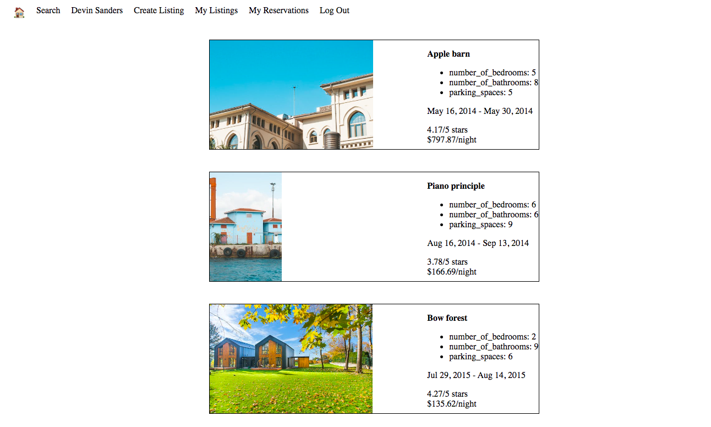
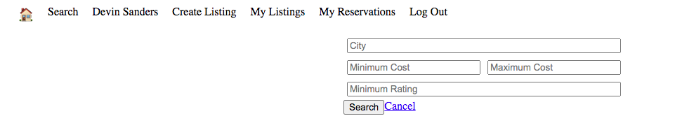
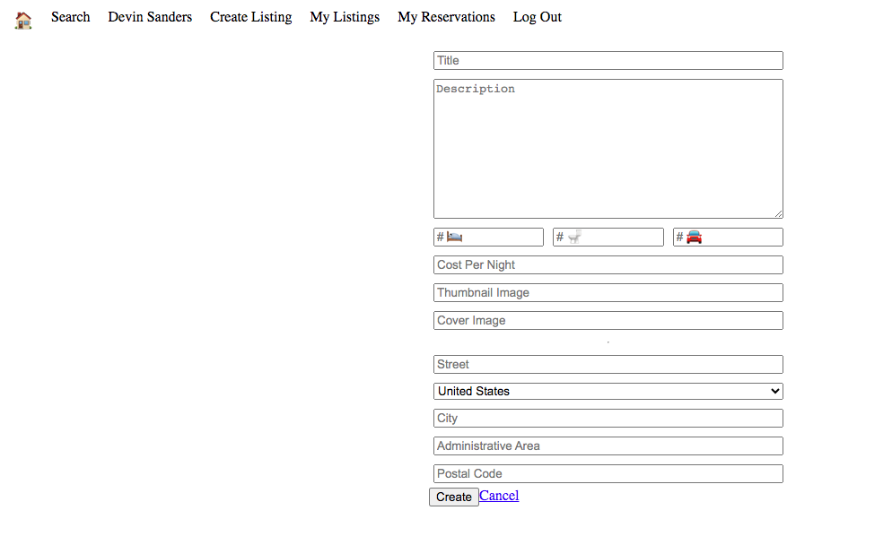

# LightBnB Project

A simple multi-page Airbnb clone that uses a sever-side Javascript to display the information from queries to web page via SQL queries.

## Getting Started

1. [Create](https://github.com/Situ2000/LightBnB) a new repository using this repository as a template.
2. Clone your repository onto your local device.
3. Install dependencies using the `npm install` command.
3. Start the web server using the `npm run local` command. The app will be served at <http://localhost:3000/>.
4. Go to <http://localhost:3000/> in your browser.

## Final Product

### - Your Listings/Reservations Page
This is the page showing all your listings or reservations.

### - Search Page
This is the page that you can search the result with filtering your requirements.

### - Posting Page
This is the page that you can post your new properties.

## Dependencies

- cookie-session
- pg
- Express
- Node 5.10.x or above